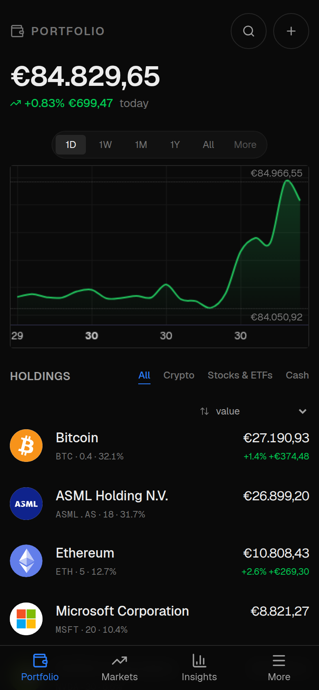
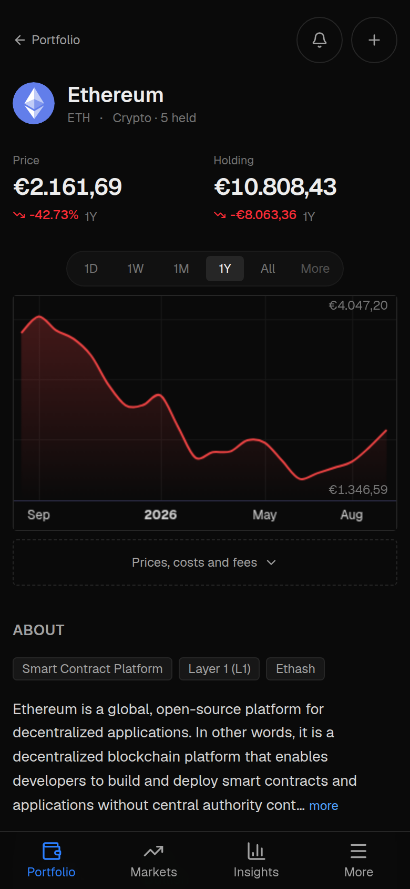
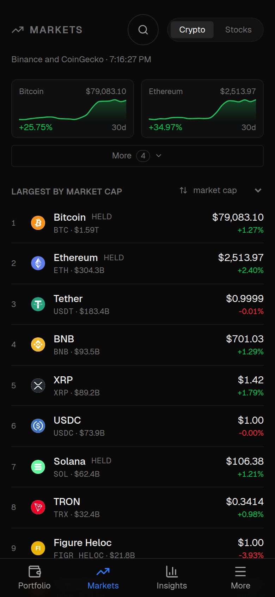
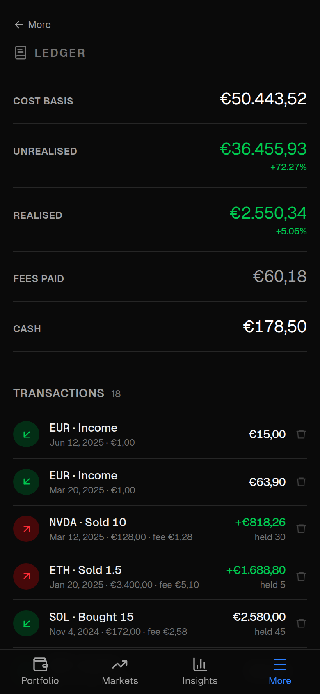
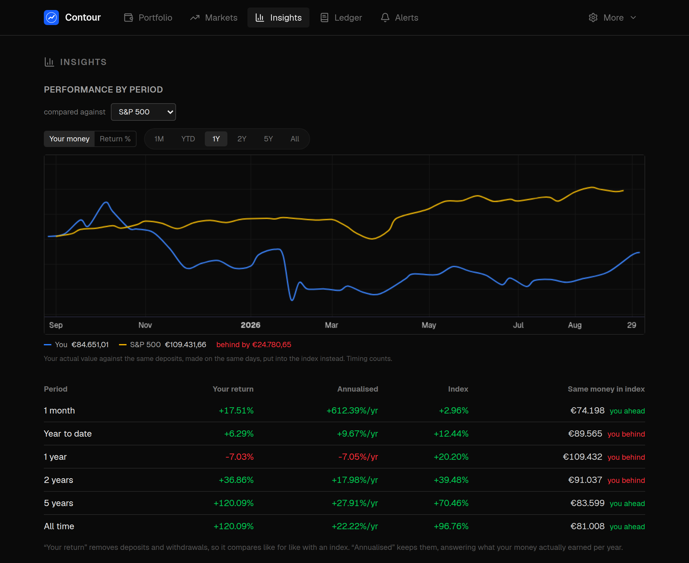

# Contour

A portfolio tracker for crypto and equities that runs on your own machine, or
on your own phone, and asks nobody's permission to do it.

There is no account, no sign-up and no Contour server. Your holdings, what you
paid, and what you have done with them are a file on hardware you control. The
Android build is complete without a server at all: it keeps its own database
and answers every screen from it, with the network off.

**AGPL-3.0-or-later.** Self-hosted, single-user, and built for one person who
wanted to stop paying a subscription to look at their own numbers.

## Why it exists

Delta was free. Then it was a subscription, and the numbers you had spent years
typing in were behind it.

That is the pattern, and it is not Delta's alone: a tracker is free while it is
gathering users, and priced once leaving has become expensive. What makes
leaving expensive is never the software. It is that your transaction history —
every buy, every fee, every date — lives in someone else's database, exportable
on their terms, in their format, for as long as they care to support it.

Contour is the other arrangement. Your ledger is a file on your own machine. The
app reads it; nothing else does.

- **Bring your history with you.** Import a Delta-by-eToro CSV export and your
  positions, cost bases and dates come across intact.
- **Take it away again, whenever.** Export the whole ledger to CSV or JSON in
  one click. Not a support ticket, not a GDPR request, not a scraper — a button,
  and a file you can read in a text editor.
- **No account, so nothing to lock.** There is no sign-up, no server of ours to
  go down or go paid, and no version of this where a feature you use is moved
  behind a tier.
- **Private by design, not by policy.** A privacy policy is a promise about what
  someone chooses to do with your data. Keeping the data on your device is a
  fact about what they *can* do with it. `docs/security-review-2026-08-30.md`
  lists every request the app makes, including the ones that are unavoidable.

If Contour stops suiting you, export and go. A tool you can leave without
losing anything is the only kind worth trusting with a decade of records.

## What it looks like

| Portfolio | An asset | Markets | Ledger |
|---|---|---|---|
|  |  |  |  |

Benchmarks, on a wider screen — your actual value against the same deposits made
on the same days, put into an index instead:



*The holdings above are made up. Prices and market data are live; the
transactions behind them are an illustrative ledger, not anybody's positions.*

## What it does

- **Portfolio** — holdings, valuation, day change, and a history chart over any
  timeframe. Multi-currency, converted at the rate on the *trade's* date rather
  than today's, so a cost basis stays put.
- **Ledger** — every transaction, typed in or imported from a Delta-by-eToro
  CSV export, and exported back out again.
- **Insights** — benchmarks against what you could have bought instead, what
  actually made the money, and how concentrated you are.
- **Markets** — an index strip, a ranked table, the day's winners and losers.
- **Alerts** — price targets and percentage moves, evaluated on the device and
  posted as ordinary Android notifications.
- **Webhooks** — every alert can also be POSTed as JSON to an address you
  choose: a trading bot, an automation flow, a chat relay, a script of your
  own. Contour decides *when*; what happens next is yours.
- **The tool it grew out of** — a port of a Bitcoin risk-metric strategy, with a
  live candlestick chart, historical backtesting and a PineScript analyzer.
  One section of the app now, rather than the whole of it.

## The app and the server

They are two applications, not one thing in two places. The phone build is
complete on its own; the server adds what a machine that stays awake and keeps a
filesystem can do. Run either, or both.

| | Android app | Server (web) |
|---|---|---|
| **Where your data lives** | on the phone, its own database | on your machine |
| **Works with no network** | yes, prices absent and said so | no |
| Portfolio, valuation, history | ✅ | ✅ |
| Ledger, cost basis, realised profit | ✅ | ✅ |
| Insights — benchmarks, contributors, concentration | ✅ | ✅ |
| Markets board | ✅ | ✅ |
| One exchange's members and range | — | ✅ |
| Delta CSV import, CSV/JSON export | ✅ | ✅ |
| Multi-currency, converted at the trade's date | ✅ | ✅ |
| Price-target and percentage-move alerts | ✅ | ✅ |
| Risk-metric (indicator) alerts | — | ✅ |
| **How alerts reach you** | Android notifications | webhook + Web Push |
| **When alerts are checked** | on open, and every ~30 min *if Android allows* | on a schedule you set |
| Candlestick chart with the risk metric | — | ✅ |
| Backtester | — | ✅ |
| PineScript analyzer and script library | — | ✅ |
| Full equity background panel | partial | ✅ |
| Lock | the device lock, and its biometrics | password and passkeys |
| Opt in to Android's Google Drive backup | ✅ | — |
| Install as a PWA, iPhone included | — | ✅ |

**The gaps are deliberate, and each has a reason.**

*The strategy tooling* — chart, backtester, analyzer, indicator alerts — needs a
server-side price proxy and a filesystem, and the indicator needs 1,460 daily
bars of warm-up before it means anything. That is not work for a phone.

*Alert timing* is the difference that matters most. The phone checks whenever you
open it, which is guaranteed, and every half hour in the background, which is
not: Android treats a periodic job as a suggestion, and a battery-optimised
phone can defer it for hours or skip it. A server is simply not asleep. If alerts
need to be dependable, that is the reason to run one.

*There is no sync.* The phone's ledger and the server's are separate, and a
portfolio moves between them as an export file. Two ledgers that can disagree is
the largest open question in the project, and it is honest to say so rather than
imply a pairing that does not exist.

*No login on the phone.* No session, no `SESSION_SECRET` — the device lock is the
lock. An app whose lock it cannot itself reset is the point.

## Local first, and what that rules out

Decided deliberately, and every design question resolves against it.

**Values, quantities, cost bases and history never leave the device.** There is
nowhere for them to go.

**The tickers do, and that is worth saying plainly.** Pricing a portfolio means
naming it: Binance receives the whole coin set in one request, Yahoo one request
per equity, and the background alert check repeats both every half hour with the
app closed. That cannot be otherwise without a proxy you run yourself. Settings
→ Privacy has a switch that asks Binance for the *whole market* and picks yours
out on the device, so the request says nothing about you — it costs about 26 KB
a refresh instead of a few hundred bytes. Shares have no equivalent; no provider
publishes every listing at once.

What is avoidable is avoided. Asset logos are bundled in the APK rather than
fetched, because asking a CDN for a coin's icon tells it what you hold. Network
access is injected rather than reached for, so what talks to the outside is
countable — `docs/security-review-2026-08-30.md` counts it.

**Android backup is off unless you ask.** One directory is eligible and it is
empty until you switch it on in Settings → Privacy, and even then it holds an
export of your transactions rather than the database.

**This rules things out:** no telemetry, no analytics, no crash reporting that
ships a payload, and no feature whose only implementation needs a service this
project runs. A server may be added; it may never be required.

**And what a server is actually for.** The phone checks alerts whenever you open
the app and every half hour in the background — but that half hour is Android's
to grant, and a battery-optimised phone can defer it for hours or skip it
entirely. A missed alert is indistinguishable from a market that did not move,
which is the worst way for a feature to fail.

Running Contour on something that stays awake fixes that. A machine you already
leave on evaluates alerts on a schedule you set, and dispatches them to your
webhook and to your devices. It is the same code and the same ledger; the
difference is that a server is not asleep. **Optional, and that is the point** —
the phone is complete on its own, and adding a server makes alerts more reliable
without making anything a requirement.

## Running it

Needs Node 22 and, for the Android build, JDK 21 and the Android SDK.

```bash
npm install
npx prisma generate      # once on a fresh clone, before the app will start
npm run dev              # http://localhost:3000
```

On first run you are redirected to `/setup` to set the app password.

<details>
<summary><b>Serving it on a domain, with push notifications</b></summary>

1. Copy `apps/web/.env.example` to `apps/web/.env`. Fill `SESSION_SECRET` and
   `CRON_SECRET` (`openssl rand -hex 32`) and VAPID keys
   (`npx web-push generate-vapid-keys`).
2. `npm run build && npm run start` — port 3000.

   ```ini
   [Unit]
   Description=Contour
   After=network.target

   [Service]
   WorkingDirectory=/path/to/contour
   ExecStart=/usr/bin/npm run start
   Restart=on-failure
   User=you

   [Install]
   WantedBy=multi-user.target
   ```

3. Reverse proxy — Caddy gets you Let's Encrypt for free:

   ```
   contour.example.com {
       reverse_proxy localhost:3000
   }
   ```

4. Evaluate alerts on a schedule — this is what makes them reliable, since a
   machine that stays awake is not subject to a phone's battery rules:

   ```
   */5 * * * * curl -fsS -H "Authorization: Bearer $CRON_SECRET" \
       https://contour.example.com/api/cron/evaluate
   ```

5. **On iPhone**: open the site in Safari → Share → *Add to Home Screen*, then
   Settings → *Enable notifications*. Web Push needs the installed app, iOS
   16.4+.

</details>

## The Android app

The same screens, with no server behind them. The services that answer an HTTP
request on the desktop run against a SQLite database on the device instead, so
the portfolio, ledger, insights and markets all work with the network off —
prices are simply absent, and say so.

```bash
npm run build --workspace @contour/mobile
npm run android:sync
npm run android:build     # android/app/build/outputs/apk/debug/app-debug.apk
```

`adb install -r android/app/build/outputs/apk/debug/app-debug.apk`, or copy it
to the phone and open it. Point Gradle at your SDK with
`android/local.properties` (`sdk.dir=/path/to/Sdk`) and set `JAVA_HOME`.
`npm run android:release` and `npm run android:bundle` produce the signed
release APK and the Play bundle — see `docs/play-release.md`, including why an
unsigned artefact is the correct default when no key is configured.

Every change needs a new APK; nothing is served live any more. That is the price
of it working with the network off. Settings → About → *Download the Android
build* streams the latest one from a running desktop instance.

### Two apps, side by side

The LAN wrapper did not go away, and the two install alongside each other.

| | Standalone | Wrapper |
|---|---|---|
| Built by | the commands above | `CONTOUR_URL=http://…` set first |
| Application id | `app.contour.standalone` | `app.contour.local` |
| Launcher name | Contour | Contour LAN |
| Data | its own, on the device | the server's |
| Works offline | yes, without prices | no |

Different application ids deliberately: with one id each install would replace
the other, and replacing the wrapper leaves you looking at an empty portfolio.
`android/app/build.gradle` reads `CONTOUR_URL` to pick the id, the launcher
name and the deep-link scheme, so the two cannot drift apart. Both write to
`app-debug.apk` — copy one aside before building the other.

## Layout

```
packages/core     Pure logic. No I/O, no framework. Browser, server and APK.
packages/data     The ports (Store, Net), the services over them, and the
                  DataClient every screen talks to. One contract suite runs
                  against every implementation.
packages/ui       Shared React components. No screen names a URL.
apps/web          The Next server app: pages, API routes, Prisma, auth.
apps/mobile       The device build. Static export, SQLite, no server.
```

The seam is the point: a service takes its outside world as arguments, so the
same code answers an HTTP request on a desktop and a method call inside an APK.
Tests fail the build if a package reaches for Prisma, the filesystem or a global
`fetch`.

```bash
npx vitest            # 1,046 tests
npm run typecheck
```

## Documentation

`CLAUDE.md` is the map — architecture, conventions, and why each of them is
what it is. `BRAND.md` governs anything user-facing. `docs/` holds the rest,
including `carried-forward.md` (what is known and not done),
`android-launch.md` (what a cold start actually draws, measured off screen
recordings), `asset-logos.md`, `security-review-2026-08-30.md` and
`play-release.md`.

## Licence

**AGPL-3.0-or-later** — full text in [LICENSE](LICENSE), copyright line and
exceptions in [NOTICE](NOTICE).

**Section 13 is why AGPL and not GPL.** Modify this and let other people use it
over a network, and you owe those users your source. Running it unmodified, or
running it for yourself, asks nothing of you.

The risk metric in `samples/risk-metric.pine` and `packages/core/src/indicator/`
is this project's own work and covered by that grant. Its lineage is recorded in
NOTICE: metric 1 follows the idea in Oakley Wood's "Risk Metric" indicator with
refitted coefficients, and metrics 2 and 3 follow ideas of Ben Cowen's and of
the TradingView user "wugamlo". Acknowledged because it is the right thing to
do, not because anything was transcribed.

The TradingView attribution rendered in the app satisfies Lightweight Charts'
Apache-2.0 terms, and is why every chart sets `attributionLogo: false`. It is
not decoration; removing it without replacing it is a breach.
